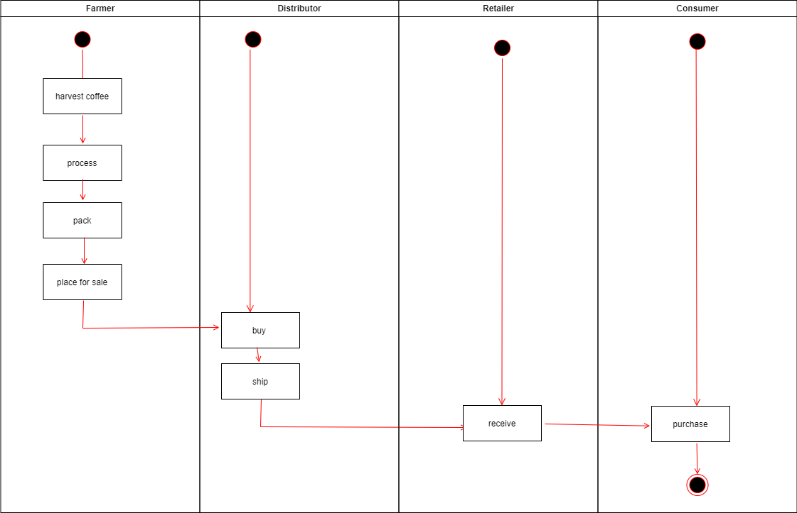
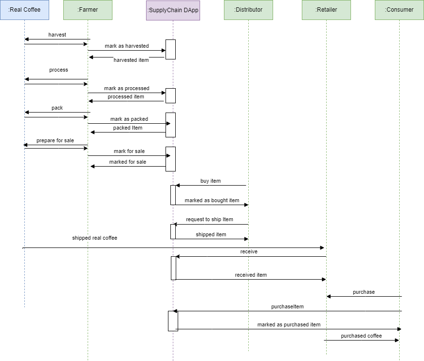
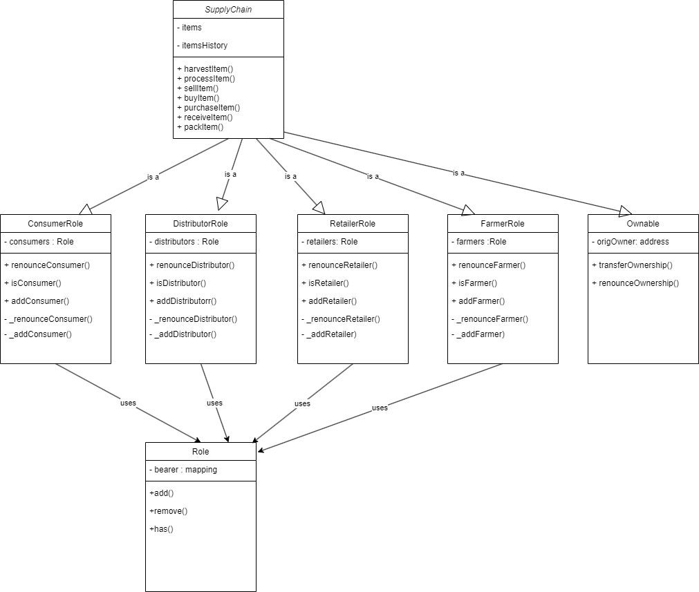
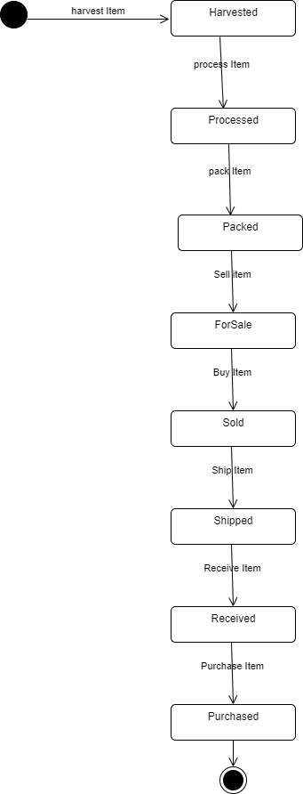
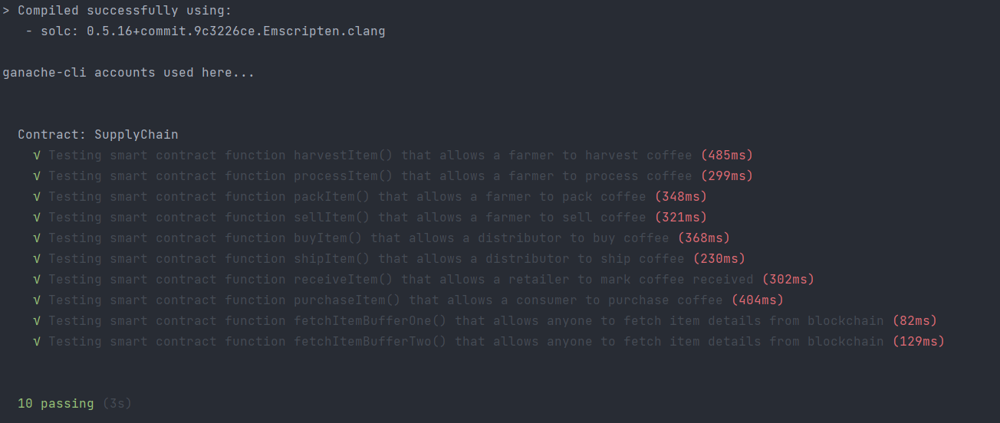

## Supply Chain DApp

### UML Diagrams

For the UML diagrams please check the folder /images.

- Activity diagram
  
- Sequence diagram
  
- Class diagram
  
- State diagram
  

### Libraries and Tools used

Libraries used (contents of the package.json):

 ```  
  "dependencies": {
    "web3": "^1.10.0",
    "web3-utils": "^1.10.0",
    "truffle-hdwallet-provider": "^1.0.17",
    }
```

* web3 1.10.0 used for the frontend user interface and connection with smart contract on the ethereum network.
* web3-utils 1.10.0 for representation of product price as BN
* truffle-hdwallet-provider 1.0.17 was used for deployment to Sepolia Test Etherium Network.

For development, test and deployment I used truffle, ganache-cli.

* Truffle v5.1.14-nodeLTS.0 (core: 5.1.13)
* Node v16.13.1

### IPFS

IPFS was not used.

### General information:

A step by step that tell you have to get a development env running

Clone this repository:

```
git clone https://github.com/udacity/nd1309/tree/master/course-5/project-6
```

Change directory to ```project-6``` folder and install all requisite npm packages (as listed in ```package.json```):

```
cd project-6
npm install
```

Launch Ganache:

```
ganache-cli -m "spirit supply whale amount human item harsh scare congress discover talent hamster"
```


In a separate terminal window, Compile smart contracts:

```
truffle compile
```

This will create the smart contract artifacts in folder ```build\contracts```.

Migrate smart contracts to the locally running blockchain, ganache-cli:

```
truffle migrate
```

Test smart contracts:

```
truffle test
```

All 10 tests should pass.

In a separate terminal window, launch the DApp:

```
npm run dev
```

Passed Tests:



### Deployment

**SupplyChain** smart contract deployed to the following address on the Sepolia network:

```
transaction hash:    0xfbb93c23b274ebbca919b04974c6b4d889258def560fcb3def02aeb967ac3255
contract address:    0xd4d9688bC9403DA27700f6c5D6c09A5B808880eA
account:             0xe946F6081990552E9398965805C07EF1F384a410
```

Migrations:

```
transaction hash:    0x3758ebc388121379e6a4cb0519b2e17113ef049554054cae3739fac65a9951b2
contract address:    0xD101995e2E8f9e6c4128aCf4dF984AD8542b0088
account:             0xe946F6081990552E9398965805C07EF1F384a410
```